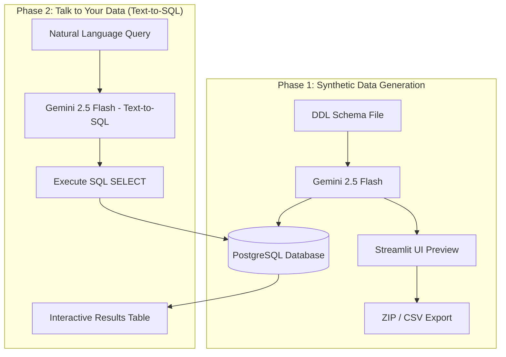

# 📊 Synthetic Data Generator & Text-to-SQL Assistant

An end-to-end AI-powered application designed to streamline synthetic relational data creation and enable natural language database querying. Built with **Streamlit**, **Google Gemini 2.5 Flash (Vertex AI)**, and **PostgreSQL**.

---

## 🎯 Project Objectives

This project solves two critical data engineering challenges:
1. **Cold-start Database Populating:** Generating schema-compliant, highly realistic synthetic data directly from DDL SQL scripts while maintaining complex relational integrity (foreign keys, primary keys, and data types).
2. **Data Accessibility (Text-to-SQL):** Allowing non-technical users and analysts to query relational databases using natural language prompts without writing manual SQL SELECT statements.

---

## ✨ Key Features

### 🚀 Phase 1: Synthetic Data Generation
* **DDL Schema Parsing:** Upload `.sql`, `.ddl`, or `.txt` schema files to automatically define database structures.
* **Context-Aware Data Generation:** Powered by **Gemini 2.5 Flash**, generating relational rows that strictly adhere to primary key constraints and cross-table foreign key dependencies.
* **Interactive Data Preview & Editing:** Inspect generated tables in real-time and fine-tune specific tables using custom natural language prompts.
* **One-Click Export:** Download the generated dataset as a unified `.zip` archive containing individual `.csv` files for each table.
* **Automated Database Persistence:** Automatically provisions and populates target tables into a local **PostgreSQL** database.

### 💬 Phase 2: Talk to Your Data (Text-to-SQL)
* **Dynamic Schema Inspection:** Real-time extraction of active database schemas, table definitions, and column data types.
* **Text-to-SQL Translation:** Converts natural language questions (e.g., *"Show all members who borrowed books published in 2024"*) into clean, read-only SQL queries.
* **Safe Live Execution:** Executes generated queries safely against PostgreSQL and renders interactive results using Pandas DataFrames.

---

## 🛠 Tech Stack & Tools

* **Frontend / Web UI:** Streamlit
* **AI / LLM Engine:** Google Gemini 2.5 Flash via `google-genai` SDK (Vertex AI)
* **Database & Persistence:** PostgreSQL 15 (Docker Container), SQLAlchemy, Psycopg2
* **Data Wrangling:** Pandas
* **Observability & Telemetry:** Langfuse
* **Environment & Security:** Python 3.9, `.streamlit/secrets.toml` secret isolation

---

## 🏗 Architecture & Data Flow


---

## 🚀 Quickstart Guide

### 1. Prerequisites
* **Docker** running locally.
* **Python 3.9+** installed.
* GCP credentials configured for **Google Cloud Vertex AI**.

### 2. Database Setup (Docker)
Run a local PostgreSQL container:
```bash
docker run -d \
  --name synthetic_postgres \
  -e POSTGRES_PASSWORD=postgrespassword \
  -e POSTGRES_DB=synthetic_db \
  -p 5432:5432 \
  postgres:15
